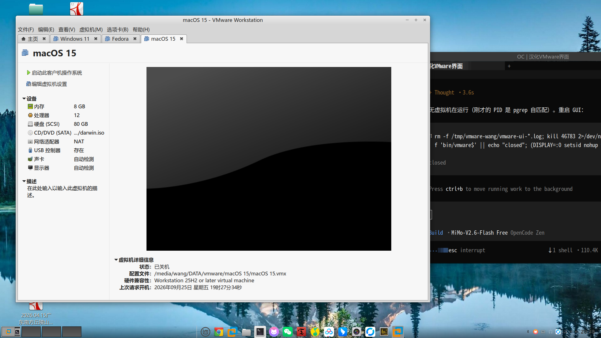
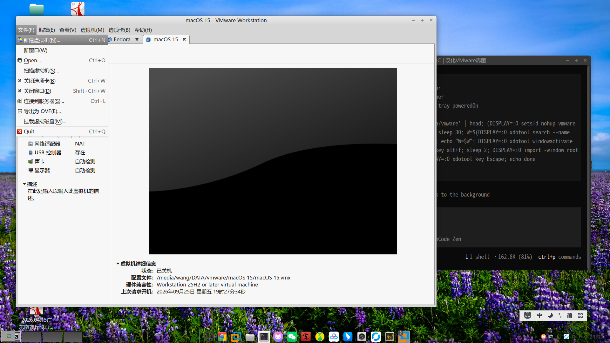

# Linux 版 VMware Workstation 中文语言包（zh_CN）

> 一键汉化 Linux 版 VMware Workstation / Player 的图形界面，已翻译 **2822 条**界面文本，
> 不修改任何程序文件、重启电脑依然生效、可随时一键还原英文。

[](LICENSE)


---

## 一、这个项目是做什么的

Linux 版 VMware Workstation / Player 官方**从来不提供中文界面**：无论你的系统语言是
简体中文还是其他语言，菜单、按钮、对话框、提示信息全部是英文。这对很多用户来说是
使用上的第一道门槛。

本项目利用 VMware 程序自身内置、但官方从未启用的**多语言消息字典机制**
（`Msg_SetLocaleEx`），制作了一份中文消息字典 `zh_CN/vmware.vmsg`，把它放进 VMware
的 `messages` 目录后，VMware 启动时会自动加载其中的中文文本，覆盖程序里内置的英文，
从而实现**原生、完整、无损**的界面汉化。

一句话总结：**装一个文件，VMware 界面就变中文；删掉这个文件，就恢复英文。**

### 解决的痛点

| 痛点 | 本项目的做法 |
| --- | --- |
| 官方无中文界面，英文菜单看不懂 | 提供 2822 条高质量中文翻译，覆盖主界面、菜单、向导、对话框 |
| 改程序文件有风险，升级/卸载会坏 | **不改任何程序文件**，只新增一个纯数据文件 |
| 汉化补丁怕重启失效 | 写入系统目录 `/usr/lib/vmware/messages/`，**重启电脑依然有效** |
| 换台机器不会装 | 提供 `install.sh` / `uninstall.sh`，**一条命令完成安装与卸载** |
| 汉化后想换回英文 | `sudo ./uninstall.sh` **一键还原**，并自动备份原文件 |
| 担心补丁把程序搞崩 | 安装时用官方 `dictTool` **自动校验语法**，语法错误会拒绝安装 |

---

## 二、效果预览

**主界面（侧栏、工具栏、虚拟机详细信息、状态栏均为中文）：**



**文件菜单：**



**虚拟机菜单：**


可以看到：菜单栏 `文件(F) / 编辑(E) / 查看(V) / 虚拟机(M) / 选项卡(B) / 帮助(H)`、
工具栏提示、侧栏设备列表（`设备 / 内存 / 处理器 / 硬盘 / 网络适配器 / 描述`）、
`虚拟机详细信息` 等均已汉化，快捷键提示（如 `Ctrl+N`）原样保留。

---

## 三、工作原理（为什么这样汉化是安全的）

VMware 程序内部有一套自研的国际化机制：

1. 程序启动时调用 `Msg_SetLocaleEx`，读取系统 locale（例如 `zh_CN.UTF-8`），
   日志中会出现 `InitLocalization: Setting message locale to "zh_CN"`；
2. 随后按 locale 从 `<VMware安装目录>/messages/<locale>/<name>.vmsg` 加载消息字典；
3. 字典里存在的 key（如 `msg.vmui.linux.menu.file`），就用字典中的值**替换**程序内置
   的英文；字典里没有的 key，继续显示英文原文。

**关键点：官方 Linux 安装包里 `messages/` 目录是空的，一个 locale 文件都没有。**
也就是说这套机制 VMware 做好了却没用上——本项目只是把缺失的中文文件补进去，
走的是 VMware 自己的官方通道，因此：

* ✅ **不修改任何二进制文件**：不 patch、不 hook、不注入，VMware 文件校验不受影响；
* ✅ **不降低稳定性**：只是多读一个数据文件，出错也会自动回退到英文；
* ✅ **不惧版本升级**：升级 VMware 后字典文件不会被删除，未翻译的条目自动显示英文；
* ✅ **可彻底还原**：删掉文件即回到出厂状态；
* ✅ **重启后依然有效**：文件位于系统目录，与用户、会话、进程无关。

### 汉化覆盖范围

共提取 VMware 内置英文 **5386 条**，已完成翻译 **2822 条（约 52%）**，
优先覆盖所有高可见度界面：

| 分类 | 内容 |
| --- | --- |
| 主窗口 | 菜单栏、工具栏、侧栏库存树、选项卡、状态栏、右键菜单 |
| 虚拟机视图 | 电源、快照、克隆、挂起、全屏、拉伸/自适应、发送 Ctrl+Alt+Del 等菜单 |
| 首次向导 | 新建虚拟机向导、新建文件夹、连接服务器、导出 OVF、挂载虚拟磁盘 |
| 设置对话框 | 硬件列表、内存/处理器/硬盘/网络/显示/声卡/USB/共享文件夹/选项页 |
| 快照管理 | 快照树、拍摄/还原/删除/克隆、AutoProtect 设置 |
| 网络与主机 | 虚拟网络编辑器、子网/DHCP/NAT 配置界面 |
| 通用组件 | 按钮、标签、提示、错误信息、任务列表、消息日志 |
| Linux 版专属 | 文件菜单、窗口动作、Player 风格界面、库存界面 |

未翻译的条目（多为低频错误信息、命令行帮助、长段落技术说明）会**原样显示英文**，
不影响任何功能。

---

## 四、快速开始

### 4.1 环境要求

1. **VMware Workstation 或 Player（Linux 版）**
   本补丁按 VMware Workstation **26.0.1** 制作与实测；其他 15.x / 16.x / 17.x /
   18.x 及 Player 版本同样适用（字典 key 长期稳定，个别新增条目会显示英文）。
2. **系统 locale 为中文**（VMware 据此决定加载哪个目录）：

```bash
locale      # 应显示 LANG=zh_CN.UTF-8
```

若不是中文，先设置（只需设置一次，重启后仍然有效）：

```bash
sudo localectl set-locale LANG=zh_CN.UTF-8
# 或写入 ~/.bashrc：export LANG=zh_CN.UTF-8
```

3. 需要 `sudo` 权限（文件要装进 `/usr/lib`）。
4. Python 3 —— 仅在**重新构建字典**时需要，普通安装用不到。

### 4.2 安装（一条命令）

```bash
git clone https://github.com/ltbkq/vmware-zh-patch-linux.git
cd vmware-zh-patch-linux
chmod +x install.sh uninstall.sh
./install.sh
```

安装脚本会依次自动完成：

1. **定位目录**：依次探测 `/usr/lib/vmware/messages`、`/usr/lib/vmware-player/messages`
   等常见路径；都找不到时，从 `vmware` 可执行文件的安装前缀反查，确保不同发行版、
   不同安装方式（官方 bundle / deb / rpm）都能装对位置；
2. **备份原文件**：若已存在 `vmware.vmsg`，先备份为 `vmware.vmsg.orig`（只备份一次）；
3. **安装字典**：复制到 `messages/zh_CN/vmware.vmsg`，权限设为 `644 root:root`；
4. **语法校验**：调用 VMware 官方 `dictTool print` 验证字典可被正确解析，
   **校验失败会报错退出**，绝不留下一个会让程序报错的坏文件；
5. 输出生效条件提示。

### 4.3 让它显示出来

安装后**完全退出并重启 VMware**（注意：包括右下角托盘图标，可右键退出或执行
`pkill -f vmware-tray`），重新打开即可看到中文界面。

**重启电脑后依然有效**——文件已写入系统目录，与本次会话无关。

### 4.4 卸载（一条命令，随时还原）

```bash
sudo ./uninstall.sh
```

* 若安装时备份过原文件 → 恢复 `vmware.vmsg.orig`；
* 若没有备份 → 直接删除中文字典，并清理空目录；
* 重启 VMware 后即恢复纯英文界面。

### 4.5 手动安装（不用脚本）

```bash
sudo mkdir -p /usr/lib/vmware/messages/zh_CN
sudo cp vmware.vmsg /usr/lib/vmware/messages/zh_CN/vmware.vmsg
sudo chmod 644 /usr/lib/vmware/messages/zh_CN/vmware.vmsg
```

手动卸载：

```bash
sudo rm -f /usr/lib/vmware/messages/zh_CN/vmware.vmsg
```

---

## 五、常见问题（FAQ）

**Q1：重启电脑后还会是中文吗？**
会。字典装在系统目录 `/usr/lib/vmware/messages/zh_CN/`，与开机、登录、重启无关。
唯一条件是系统 locale 仍为中文。

**Q2：升级 VMware 后会失效吗？**
不会被卸载。升级程序文件不影响 `messages` 目录；如果新版本新增了英文条目，
那几条会显示英文，其余照常中文。届时可用新版 VMware 重新提取并补充翻译。

**Q3：装了补丁后 VMware 打不开 / 界面报错怎么办？**
本字典已通过官方 `dictTool` 校验，安装脚本也会再校验一次，正常不会出现该情况。
万一出现，执行 `sudo ./uninstall.sh` 一秒还原；程序本身在字典加载失败时也会
自动回退英文，不会崩溃。

**Q4：系统是英文的，但我想看中文界面怎么办？**
界面语言完全由系统 locale 决定，临时切换方式：

```bash
LC_ALL=zh_CN.UTF-8 LANG=zh_CN.UTF-8 vmware
```

想长期生效就把系统 locale 设为 `zh_CN.UTF-8`（见 4.1）。

**Q5：能用于其他机器 / 分发给别人吗？**
能。这就是本项目做成「仓库 + 安装脚本」的原因：对方只需
`git clone` 后运行 `./install.sh`，脚本会自行探测其 VMware 安装位置。
补丁文件本身是纯文本数据，可任意拷贝。

**Q6：VMware Fusion（macOS）或 Windows 版能用吗？**
不能。本补丁针对 Linux 版的 `messages/<locale>/*.vmsg` 机制；
macOS/Windows 版使用不同的资源与语言包体系。

**Q7：为什么不改程序里的英文字符串，而要绕这个机制？**
因为修改二进制会破坏文件完整性、可能触发校验问题，且升级即失效；
而 `messages` 字典是 VMware 官方留出的正规扩展点，安全、可逆、跨版本稳定。

**Q8：某处还是英文？**
见「已知限制」。也可以帮忙补充翻译（见第七节）。

---

## 六、仓库文件说明

```
vmware-zh-patch-linux/
├── README.md          本说明文档
├── LICENSE            MIT 许可证（附版权声明）
├── install.sh         安装脚本（定位目录 → 备份 → 安装 → 校验）
├── uninstall.sh       卸载脚本（恢复备份 / 删除字典）
├── vmware.vmsg        汉化字典成品，可直接分发使用
├── build.py           构建脚本：由 zh/*.tsv 生成 vmware.vmsg 并做严格校验
├── strings.json       从 VMware 提取的全部英文原文（key → 英文，含顺序）
├── zh/                翻译源表，一行一条：`key<TAB>中文`
│   ├── 01_uiManager.tsv        主窗口菜单/工具栏动作
│   ├── 02_buttons.tsv          通用按钮
│   ├── 03_window.tsv           窗口与容器
│   ├── 04_player.tsv           Player 风格界面
│   ├── 05_cui_vm.tsv           虚拟机相关组件
│   ├── 06_ui_other.tsv         其他 UI 文本
│   ├── 07_cui_wizard.tsv       各类向导
│   ├── 08_lui.tsv              库存（侧栏）界面
│   ├── 09_vmui_linux_a.tsv     Linux 版界面 A
│   ├── 10_vmui_linux_b.tsv     Linux 版界面 B
│   └── 11_netcfg.tsv           网络配置工具
└── screenshots/       README 用的效果截图
```

---

## 七、参与贡献：补充更多翻译

项目采用「**英文提取 → 中文翻译表 → 自动构建**」的流水线，任何人都能轻松参与：

### 7.1 修改翻译

1. 编辑 `zh/` 下任意 `.tsv` 文件，格式为 `key<TAB>中文`（一行一条）；
2. 单元格内的换行用 `\n` 表示，反斜杠用 `\\` 表示；
3. 重新构建并校验：

```bash
python3 build.py
```

`build.py` 会自动检查三件事，任何一项不过都会报错退出：
* **key 必须存在于 `strings.json`**（防止写错 ID）；
* **占位符必须与英文原文完全一致**（`%s`、`%d`、`%u`、`%zd` 等，数量与顺序都不能变，
  否则运行时会崩溃或乱码）；
* 不允许多余的 `%` 字符。

4. 本地装上验证：`./install.sh` → 重启 VMware 检查 → 提交 PR。

### 7.2 翻译规范

* **占位符原样保留**：`%s`、`%d`、`%u`、`%zu`、`%zd` 一个都不能改；
* **快捷键助记符**用 `文件(_F)` 这种中文习惯写法，保证 `Alt+F` 依然可用；
* **引号**在中文语境里用中文引号 `“ ”`，避免与字典语法冲突；
* **占位/省略号**保持与英文一致的语义（`...` 表示会打开对话框）；
* 术语与 VMware 官方中文文档保持一致（如 虚拟机 / 快照 / 挂起 / 克隆 / 库存）。

### 7.3 提 Issue

发现没翻译的地方，欢迎提 Issue，附上**界面位置 + 英文原文**即可。

---

## 八、技术细节：字典格式备忘（供维护者）

字典文件 `vmware.vmsg` 的格式非常朴素，但**转义规则特殊**，务必遵守：

```
.encoding = "UTF-8"
msg.vmui.linux.menu.file = "_File"
msg.ui.linux.quitPrompt.single = "“%s”仍处于开机状态。|0A|0A您可以继续在后台运行它。"
```

* **首行**必须是 `.encoding = "UTF-8"`；
* 每条形如 `key = "值"`，key 必须带 `msg.` 前缀，且与程序内置英文的 key 完全一致；
* **唯一的转义机制是 `|XX` 十六进制字节**：
  * `|22` → 双引号 `"`
  * `|7C` → 竖线 `|`
  * `|0A` → 换行
  * `|0D` → 回车
  * `|09` → 制表符
* **反斜杠不是特殊字符**：写 `\n` 会原样显示成 `\n` 两个字符，不会换行；
* **裸 `"` 或裸 `|` 是致命的**：会导致整个字典
  `DictionaryParseReadLine: syntax error`，**全部翻译一起失效**（程序回退英文）；
  这就是 `build.py` 强制校验、安装时还要用 `dictTool` 复检的原因；
* **占位符必须与英文完全一致**：否则运行时格式化会错位甚至崩溃；
* 字典顺序与 `strings.json` 中的 `order` 保持一致，便于 diff 与 review。

验证命令：

```bash
/usr/lib/vmware/bin/dictTool print vmware.vmsg > /dev/null && echo OK
```

`dictTool print` 的输出即为规范转义形式，可用来核对自己的转义是否正确。

---

## 九、已知限制

* **极少数菜单项无法汉化**：例如 File 菜单中的 `Open...` 和 `Quit`，它们取自程序内建的
  GTK stock 标签，不经过 VMware 消息字典（我们已实测：修改对应 key 后界面无变化），
  属于 GTK 层的文本，本补丁无法覆盖。
* **动态/子进程文本**：由插件或子进程生成的文本可能仍为英文。
* **界面语言由系统 locale 决定**：英文系统需按 FAQ Q4 临时切换。
* **部分低频条目未翻译**：5386 条中已译 2822 条，剩余多为长段落技术说明与冷门错误
  信息，未译条目原样显示英文，欢迎补充。
* **仅限 Linux 版**：macOS / Windows 版不适用。

---

## 十、路线图

- [x] 摸清 VMware 消息字典机制与转义规则（实机验证）
- [x] 提取全部 5386 条内置英文原文
- [x] 完成 2822 条核心界面翻译
- [x] 构建脚本 + 严格校验（key / 占位符 / 语法）
- [x] 一键安装与卸载脚本，支持自动探测目录与备份
- [x] 重启持久化验证 + 效果截图
- [x] 发布 GitHub 项目，便于分发与协作
- [ ] 提升翻译覆盖率至 80%+（欢迎 PR）
- [ ] 覆盖 VMware Player / 更多历史版本实测
- [ ] 提供图形化安装界面（可选）
- [ ] 跟进 VMware 后续版本新增文本

---

## 十一、许可与免责声明

* 本仓库代码与脚本采用 [MIT License](LICENSE)。
* 本项目**仅包含中文翻译文本**，不含任何 VMware 程序文件、代码或资源。
* VMware、Workstation、Player 及相关商标归 Broadcom Inc. 所有；
  本项目为社区自制，**与 Broadcom / VMware 官方无关联、未获其背书**。
* 使用本补丁所产生的任何后果由使用者自行承担。

---

## 十二、致谢

感谢 VMware 留下了这套隐藏的多语言机制，让中文用户可以无损地汉化界面；
也感谢每一位提交翻译、反馈问题的社区用户。

**如果这个项目帮到了你，欢迎点个 ⭐ Star，让更多中文用户看见它。**
